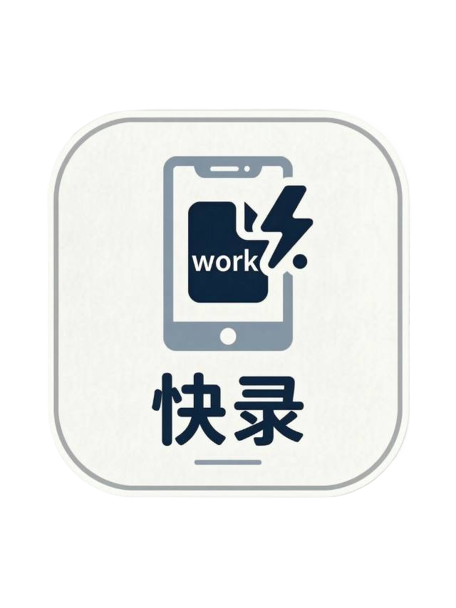
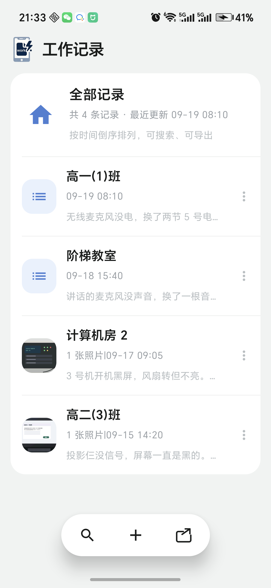
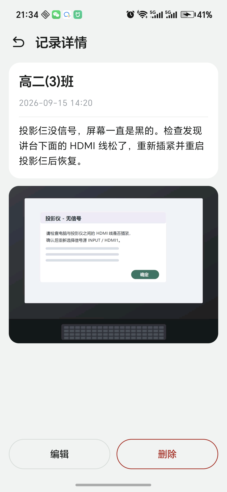
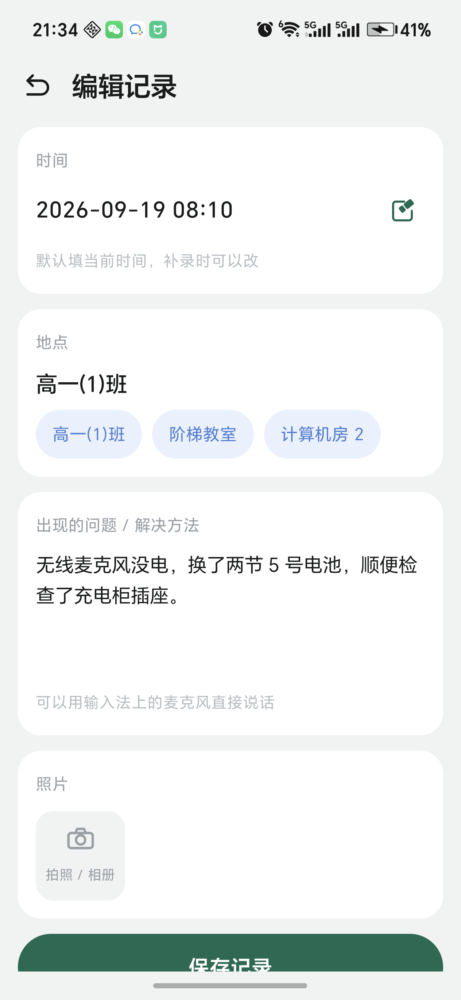
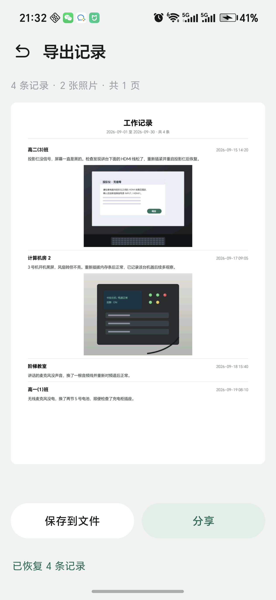
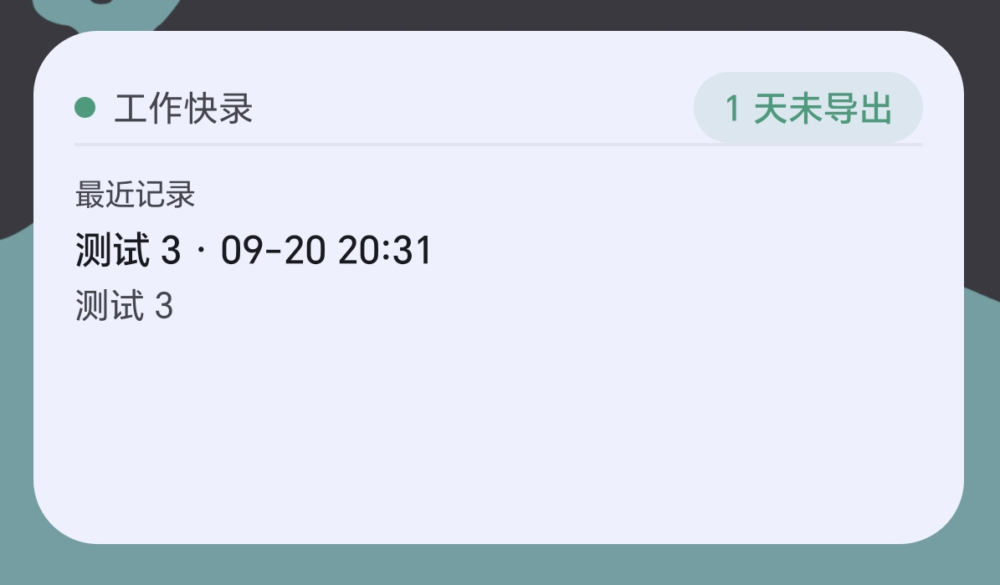

# 工作快录 (WorkLog)

给学校设备维护老师用的安卓记录 App：开机就能记，拍张照、写两句话，月底一键导出一份带照片的图文 PDF 台账。

全部数据只存在手机本地，没有账号、没有服务器，App 也没有申请网络权限。



## 下载安装

到 [Releases](https://github.com/shanheyue1995/worklog/releases/latest) 页面下载最新的
`WorkLog-v*.apk`，用手机点开安装即可（要求 Android 8.0 及以上，这个包是正式签名版，不是调试包）。
系统提示"未知来源应用"时，允许安装这一次即可。

App 里没有任何预置数据，装完是空的，直接从"新建"开始记就行。

## 它解决什么问题

学校里维护电教设备的老师，修完一台设备往往要记一笔：什么时间、在哪个教室、什么毛病、怎么修的。
现实里这件事很难坚持，原因是：

- 打字麻烦。手上还沾着灰，手机输入法敲字慢，现场也吵。
- 记录散。今天记在备忘录，明天发在企业微信，过一个月要交台账时得翻半天。
- 交材料时要"好看"。领导要的是一份能打印、能发微信的图文材料，而不是一堆聊天记录截图。

工作快录只做一件事：**把"记一笔"变成几秒钟的事，把"交台账"变成点一下的事。**

## 功能

| 模块 | 说明 |
| --- | --- |
| 记录 | 每条记录包含时间（年月日时分）、地点、出现的问题／解决方法，最多 9 张照片 |
| 列表 | 按时间倒序，支持按地点或内容关键词搜索 |
| 拍照 | 调用系统相机（不申请相机权限），照片先压缩、按 EXIF 校正方向，再存进 App 私有目录，**不进系统相册** |
| 导出 | 生成本周／本月／上月／自定义范围的 PDF 图文报告，可保存到任意位置或直接分享；分享前可在 App 内逐页预览 |
| 提醒 | 应用内提示条 + 每月 1 号通知 + 桌面小组件（显示超期天数与最近一条记录） |
| 备份 | 整包导出／恢复 zip，换手机时数据不丢 |

## 截图

下面几张图用的都是假数据（记录和照片都是编的），桌面小组件那张是实机截图。

| 记录列表 | 记录详情 |
| --- | --- |
|  |  |

| 新建／编辑记录 | 导出预览 |
| --- | --- |
|  |  |

桌面小组件（拖到桌面后的样子，上半显示"多久没导出"，下半显示最近一条记录）：



## 技术栈

| 部分 | 选择 |
| --- | --- |
| 语言 | Kotlin 2.2 |
| 界面 | Jetpack Compose + Material 3 |
| 本地数据库 | Room |
| 设置存储 | DataStore (Preferences) |
| 桌面小组件 | Glance |
| 定时提醒 | WorkManager |
| 报告导出 | 系统 `PdfDocument` + `StaticLayout`（不引第三方文档库） |
| 拍照／相册 | 系统相机 + 系统选择器（`ACTION_IMAGE_CAPTURE` / `PickVisualMedia`） |
| 备份格式 | zip + kotlinx.serialization |

构建环境：AGP 9.4、Gradle 9.7.1、JDK 17、compileSdk 37、minSdk 26（Android 8.0 起）。
开发与验证用的真机是荣耀 400 Pro（Android 16）。

## 工程结构

```
app/src/main/java/com/worklog/quickrecord/
├── data/      本地存储：Room、照片、备份包、PDF 生成
├── domain/    纯逻辑：记录、搜索、日期范围、提醒规则、导出判定（不依赖 Android，可直接单测）
├── reminder/  每月提醒：规则、任务调度、导出记账
├── ui/        Compose 界面：列表／详情／编辑／导出
├── util/      图片解码与尺寸、报告排版计算
└── widget/    桌面小组件
```

`domain` 与 `util` 下的规则都刻意做成了纯函数，就是为了能在电脑上直接跑测试，不用连真机。

## 构建与运行

要求：JDK 17、Android SDK（含 compileSdk 37 与 build-tools）。

```bash
# 打包调试版
./gradlew :app:assembleDebug

# 装到手机（需开启 USB 调试）
adb install -r app/build/outputs/apk/debug/app-debug.apk
```

两点说明：

- 本项目开发时把 JDK、Gradle、Android SDK 放在工程内的 `toolchain/` 目录（已在 `.gitignore` 中排除）。
  用 Android Studio 自带环境或自己配 `ANDROID_HOME` 都可以，不必照搬。
- 调试包固定使用工程里的 [keystore/debug.keystore](keystore/README.md)，避免调试签名在不同机器上漂移，
  导致新包装不上旧包、只能卸载重装而丢掉记录。**正式发布必须换成自己的发布签名，且不要提交**。

## 测试

```bash
./gradlew :app:testDebugUnitTest
```

目前 68 个单元测试，覆盖：日期范围计算、关键词搜索、记录校验、提醒规则与下次提醒时刻、
照片尺寸与方向、报告排版换算、导出与分享的判定规则。

## 已知限制

- 还没有发布签名配置，手机上装的是调试包。
- 每月提醒的开关在代码里有，界面上还没有入口（通知本身可以划掉）。
- 通知栏图标是临时画的形状，没和主图标统一。
- 深色模式跟随系统，但没在真机上仔细看过。
- 桌面小组件需要手动拖到桌面才能看到效果，命令行做不到。

更细的待办见 [docs/待办事项.md](docs/待办事项.md)。

## 文档

| 文档 | 内容 |
| --- | --- |
| [docs/产品设计文档.md](docs/产品设计文档.md) | 背景、定位、MVP 范围、界面规范、决策记录 |
| [docs/技术方案文档.md](docs/技术方案文档.md) | 技术选型理由、数据结构、关键流程、风险与对策 |
| [docs/待办事项.md](docs/待办事项.md) | 下一步要做的内容 |
| [docs/PROMPTS.md](docs/PROMPTS.md) | 提示词记录：这个项目是怎么一步步"说"出来的，以及可复用的提示词模板 |
| [AGENTS.md](AGENTS.md) | 本仓库的协作约定（每次改动都要提交、都要带测试） |

## 关于这个项目

这是一个只服务一个真实场景的小工具，功能刻意做得很少：能快速记、能导出、数据不丢，就够用了。
代码和文档基本是在与 AI 编程助手协作下完成的，过程记录在 [docs/PROMPTS.md](docs/PROMPTS.md)。

## 许可

MIT License，见 [LICENSE](LICENSE)。

欢迎提 Issue 说说你的用法和问题。如果要改代码，请一并补上或更新相关测试：`./gradlew :app:testDebugUnitTest` 需要全绿。
